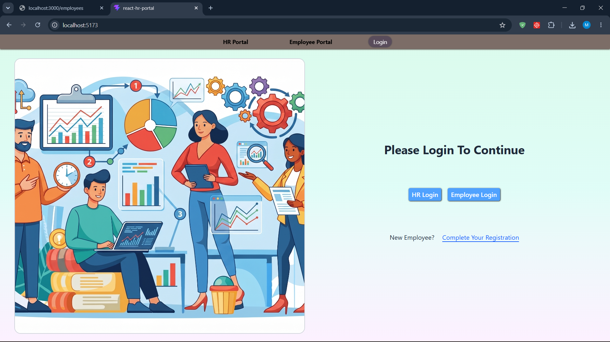
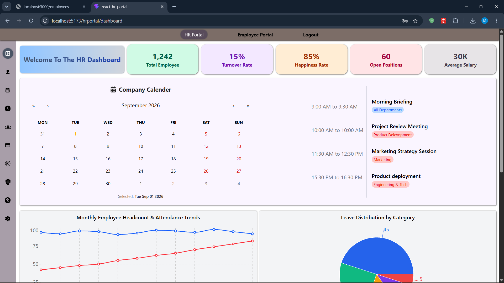
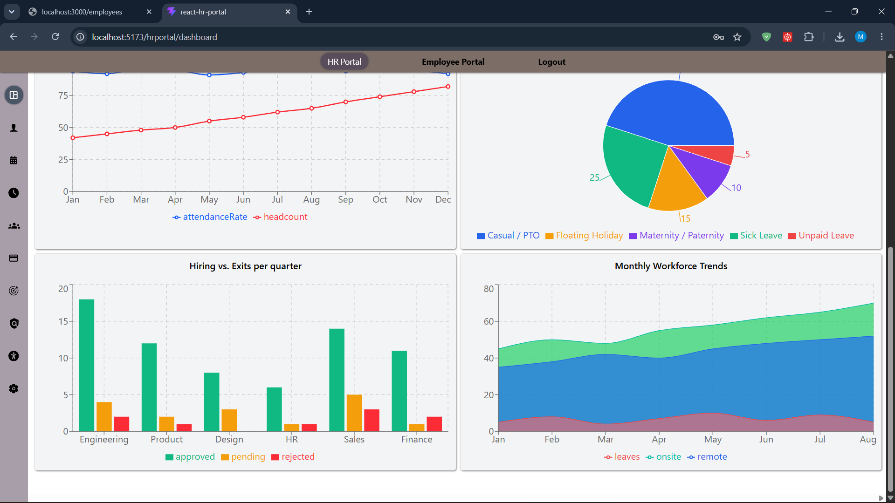
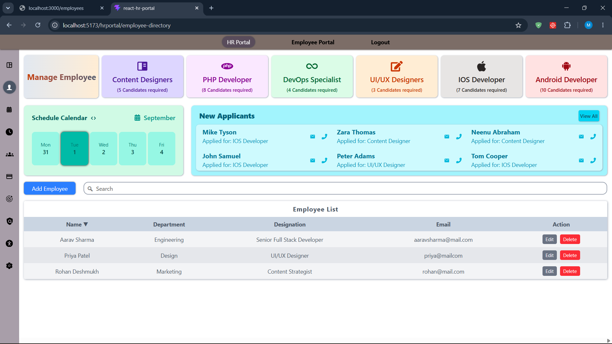
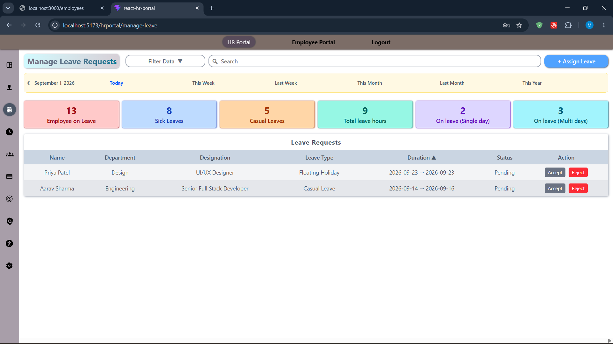
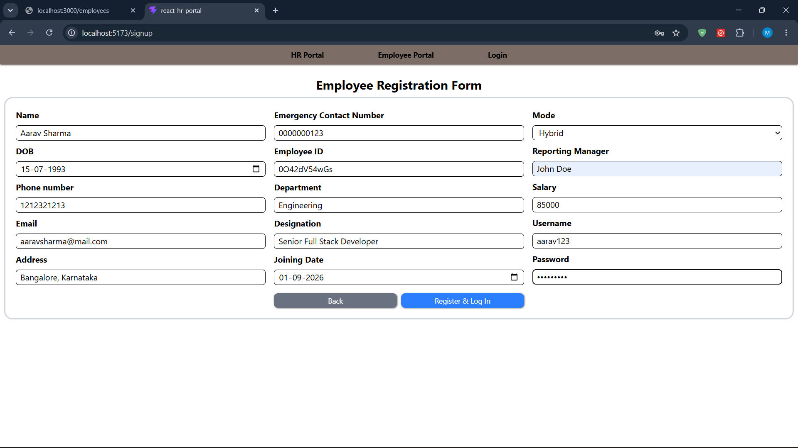
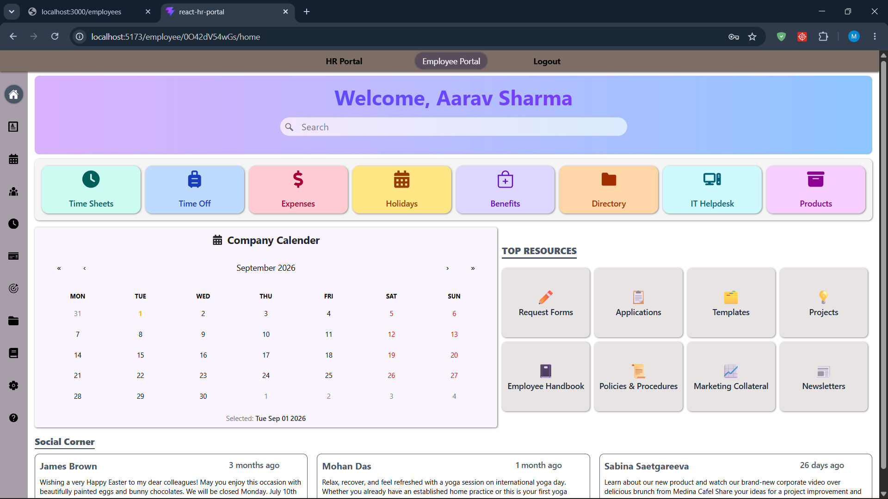
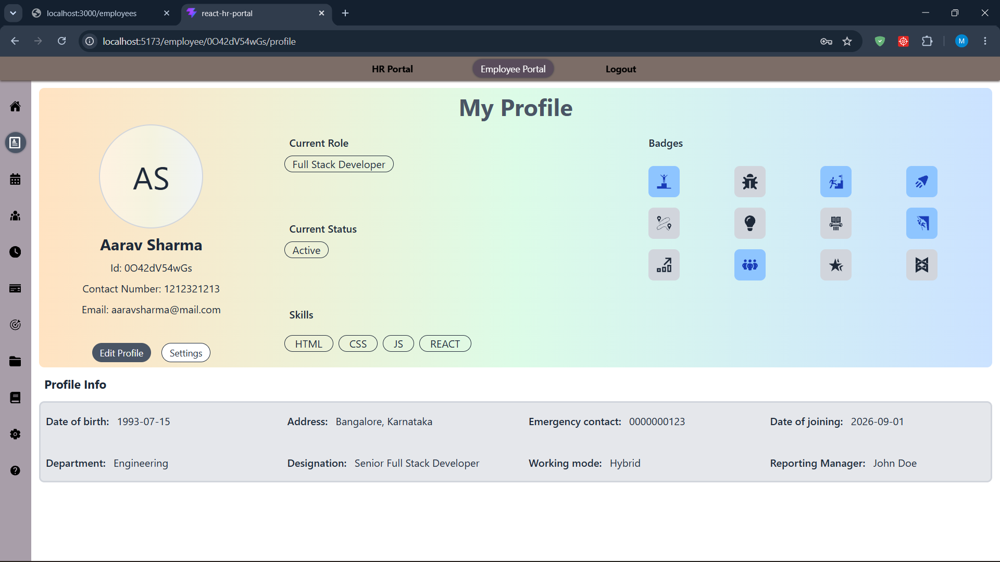
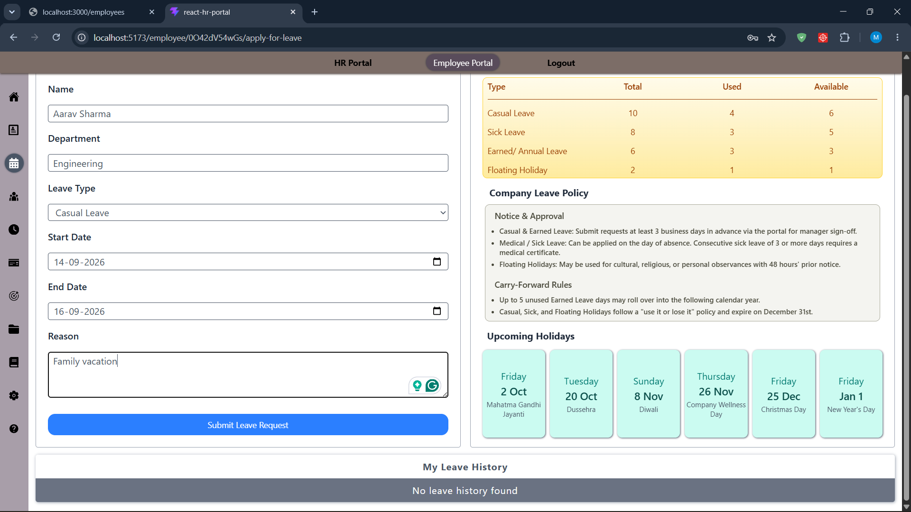
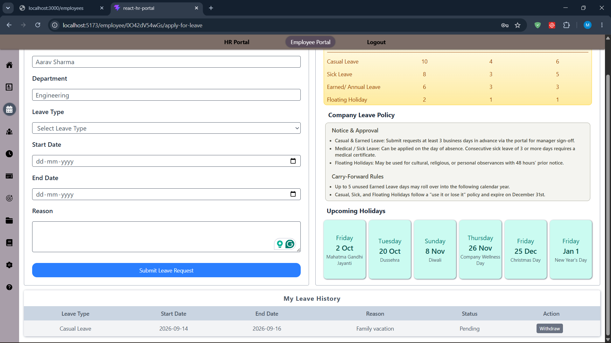

# HR Portal

A React front-end HR management application with role-based access for HR and Employees, backed by a JSON Server mock API.

## Features

- Persistent navbar (HR Portal / Employee Portal / Login) shown on every page
- Separate login flows for HR and Employees, with protected, role-based routing
- ID-verified employee registration: HR creates a profile (name, email, department, designation) which generates an employee ID; the employee verifies with that ID to complete registration
- **HR Portal**
  - Dashboard — summary cards and charts
  - Employee Directory — full CRUD, search, sort by name, calendar widget
  - Leave Management — view all leave requests, search, sort by date
- **Employee Portal**
  - Home — landing page showing the logged-in employee's name
  - My Profile — the employee's own profile details
  - My Leaves — apply for leave, view leave history
- Role-specific sidebars (hover-expand on desktop, toggle drawer on mobile)
- Fully responsive layout throughout

## Tech Stack

- React + Vite
- Redux Toolkit (`createSlice`, `createAsyncThunk`)
- React Router
- Axios
- JSON Server (mock backend)
- Tailwind CSS
- react-icons, react-calendar, date-fns, recharts

## Project Structure

```
src/
├── components/
│   ├── employee-nested-components/
│   │   ├── EmployeePortal.jsx
│   │   ├── EmployeeSidebar.jsx
│   │   └── signUPform.jsx
│   ├── hr-nested-components/
│   │   ├── AddEmployee.jsx
│   │   ├── Calendar.jsx
│   │   ├── CardsForDirectory.jsx
│   │   ├── DashboardCharts.jsx
│   │   ├── DashboardDummyData.js
│   │   ├── EditEmployee.jsx
│   │   ├── EmployeeList.jsx
│   │   ├── HRPortal.jsx
│   │   ├── HRSidebar.jsx
│   │   └── Listitem.jsx
│   ├── LoginEmployee.jsx
│   ├── LoginHR.jsx
│   ├── Navbar.jsx
│   └── ProtectedRoute.jsx
├── images/
├── pages/
│   ├── Dashboard.jsx
│   ├── EmployeeDirectory.jsx
│   ├── EmployeeHome.jsx
│   ├── EmployeeProfile.jsx
│   ├── LeaveApplication.jsx
│   ├── LeaveManagement.jsx
│   ├── Login.jsx
│   └── PageNotFound.jsx
├── slices/
│   └── EmployeeSlice.jsx
├── store/
│   └── AppStore.jsx
├── App.jsx
├── index.css
└── main.jsx
```

## Getting Started

### Prerequisites

- Node.js and npm installed

### Installation

```terminal
npm install
```

### Running the project

The frontend and the mock backend run as two separate processes — start both.

**1. Start the JSON Server backend**

```terminal
npm run dev-server
```

This serves `db.json` at `http://localhost:3000`. Employee data is available at:

```
http://localhost:3000/employees
```

**2. Start the frontend**

```terminal
npm run dev
```

## Screenshots


### Login



### HR Portal

#### Dashboard



#### Employee Directory


#### Leave Management


### Employee Portal

### Registration



#### Home


#### My Profile


#### My Leaves




## License

Not applicable.
